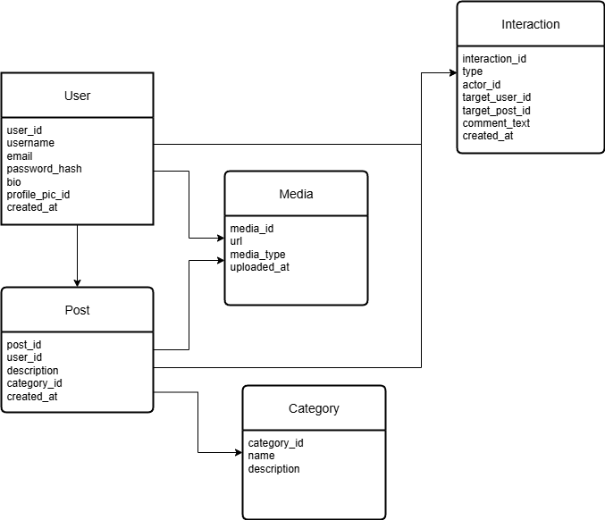

# Crafters Social Feed - ALX ProDev Frontend Project

A minimalist mobile social media app designed specifically for crafters and handmade product sellers. This application enables users to connect, engage, and market their work in real time through a dynamic and interactive feed.

## Project Overview

This project serves as a major learning showcase from the **ALX ProDev Frontend Engineering Program**, demonstrating modern mobile development practices, full-stack integration, and real-world application building skills.

## About ALX ProDev Frontend Engineering Program

The ProDev Frontend Engineering program is an intensive, hands-on curriculum designed to build world-class frontend developers. The program focuses on:

- **Modern Frontend Technologies**: React, Next.js, React Native, and TypeScript
- **Professional Development Practices**: System Design, Testing, and Deployment
- **Industry-Standard Tools**: GraphQL, API Integration, and PWA development
- **Real-World Projects**: Building production-ready applications with backend collaboration

## About ALX ProDev Backend Engineering Program

The ProDev Backend Engineering program is a comprehensive curriculum focused on building robust, scalable backend systems. This program emphasizes:

- **Core Backend Technologies**: Python, Django, REST APIs, and GraphQL
- **DevOps & Infrastructure**: Docker containerization and CI/CD pipelines
- **Database Management**: Database design, optimization, and scaling strategies
- **Advanced Concepts**: Asynchronous programming, caching strategies, and microservices architecture
- **Industry Best Practices**: Code quality, testing, security, and performance optimization

## Major Learnings & Technologies

### Frontend Technologies Covered
- **Mobile Development**: React Native with Expo SDK 53
- **Web Development**: Next.js with server-side rendering
- **Progressive Web Apps (PWA)**: Offline-first applications
- **TypeScript**: Type-safe JavaScript development
- **GraphQL**: Modern API query language and runtime
- **TailwindCSS**: Utility-first CSS framework
- **API Integration**: RESTful and GraphQL API consumption

### Backend Technologies Covered
- **Python**: Core programming language for backend development
- **Django**: High-level Python web framework for rapid development
- **REST APIs**: RESTful web service design and implementation
- **GraphQL**: Flexible query language for APIs with single endpoint
- **Docker**: Containerization for consistent deployment environments
- **CI/CD**: Continuous Integration and Continuous Deployment pipelines

### Key Frontend Development Concepts
- **System Design and Analysis**: Scalable architecture planning
- **State Management**: Redux Toolkit and Context API patterns
- **Performance Optimization**: Code splitting, lazy loading, and caching
- **Responsive Design**: Mobile-first development approach
- **Authentication & Authorization**: JWT and OAuth implementations
- **Real-time Features**: WebSocket integration for live updates

### Key Backend Development Concepts
- **Database Design**: Relational database modeling, normalization, and optimization
- **Asynchronous Programming**: Non-blocking I/O operations and task queues
- **Caching Strategies**: Redis implementation, cache invalidation, and performance tuning
- **API Security**: Authentication, authorization, rate limiting, and data validation
- **Microservices Architecture**: Service decomposition and inter-service communication
- **Performance Monitoring**: Logging, metrics collection, and system optimization

### Challenges Faced & Solutions Implemented

#### Challenge 1: Cross-Platform Compatibility
**Problem**: Ensuring consistent UI/UX across iOS and Android
**Solution**: Implemented Expo Router with platform-specific components and thorough testing on both platforms

#### Challenge 2: Real-time Data Synchronization
**Problem**: Keeping craft posts and user interactions synchronized
**Solution**: Integrated GraphQL subscriptions with Apollo Client for real-time updates

#### Challenge 3: Image Optimization for Craft Portfolios
**Problem**: Large image files affecting app performance
**Solution**: Implemented progressive image loading with Expo Image and server-side optimization

#### Challenge 4: Backend Integration
**Problem**: Coordinating with ProDev Backend learners for API development
**Solution**: Used collaborative tools and shared GraphQL schemas for seamless integration

#### Challenge 5: Database Optimization for High Traffic
**Problem**: Managing database performance under concurrent user loads
**Solution**: Implemented database indexing, connection pooling, and query optimization techniques

#### Challenge 6: Containerization and Deployment
**Problem**: Ensuring consistent deployment across different environments
**Solution**: Dockerized both frontend and backend services with multi-stage builds and environment-specific configurations

## Tech Stack Implementation

### Frontend Architecture
- **React Native** with **Expo SDK 53** for cross-platform mobile development
- **Expo Router** for file-based navigation and routing
- **TypeScript** for type safety and better developer experience
- **Apollo Client** for GraphQL state management and caching
- **React Native Reanimated** for smooth animations and transitions

### Backend Architecture
- **Django 5.0** with **GraphQL** (Graphene) for flexible API queries
- **PostgreSQL/SQLite** for robust data persistence and relationships
- **Docker** containerization for consistent development and deployment
- **Redis** caching for improved response times and session management
- **JWT Authentication** for secure, stateless user sessions
- **CI/CD Pipeline** with automated testing and deployment processes
- **CORS** configuration for seamless frontend-backend communication

## Project Structure

```
crafters-social-feed/
├── app/                 # Expo Router pages (file-based routing)
│   ├── _layout.tsx      # Root layout with navigation
│   ├── +not-found.tsx   # 404 error handling
│   └── (tabs)/          # Tab navigation for main features
│       ├── index.tsx    # Crafters feed homepage
│       ├── profile.tsx  # User profile & portfolio
│       └── notifications.tsx # Real-time notifications
├── components/          # Reusable UI components
│   ├── PostCard.tsx     # Craft post display component
│   └── PostSkeleton.tsx # Loading state component
├── hooks/              # Custom React hooks
│   ├── useFrameworkReady.ts # App initialization hook
│   └── useMockData.ts   # Development data hook
├── lib/                # Configuration and utilities
│   └── apollo-client.ts # GraphQL client setup
├── graphql/            # GraphQL operations
│   ├── queries.ts      # Data fetching queries
│   └── mutations.ts    # Data modification operations
├── types/              # TypeScript definitions
│   └── graphql.ts      # Auto-generated GraphQL types
├── assets/             # Static resources
└── backend/            # Django GraphQL API server
    ├── apps/           # Domain-specific Django applications
    │   ├── users/      # Crafter profiles and authentication
    │   ├── posts/      # Craft posts and media management
    │   └── interactions/ # Likes, comments, follows
    └── social_backend/ # Main Django configuration
```

## Setup & Installation

### Prerequisites
- Node.js 18+ and npm
- Python 3.9+ and pip
- Expo CLI (`npm install -g @expo/cli`)

### Frontend Setup
```bash
# Install dependencies
npm install

# Start development server
npm run dev

# Run on specific platform
npx expo run:ios
npx expo run:android
```

### Backend Setup
```bash
# Navigate to backend directory
cd backend

# Install Python dependencies
pip install -r requirements.txt

# Set up environment variables
cp .env.example .env

# Run database migrations
python manage.py migrate

# Start Django server
python manage.py runserver
```

## Features for Crafters

- **Craft Portfolio Showcase**: Upload and display handmade products
- **Real-time Social Feed**: See latest creations from fellow crafters
- **Interactive Engagement**: Like, comment, and share craft posts
- **Crafter Profiles**: Detailed profiles with craft specializations
- **Push Notifications**: Stay updated on community interactions
- **Search & Discovery**: Find crafters by craft type or location

## Development Workflow

- **Frontend**: Expo development server with hot reload
- **Backend**: Django development server with auto-restart
- **Database**: SQLite for development, PostgreSQL for production
- **API Testing**: GraphQL Playground at `/graphql`
- **Mobile Testing**: Expo Go app for quick device testing

## Collaboration & Backend Integration

This project demonstrates successful collaboration between **ProDev Frontend and Backend learners**, showcasing the integration of both engineering disciplines:

### Frontend-Backend Integration Achievements
- **Unified GraphQL Schema**: Seamless data flow between mobile app and Django API
- **Authentication Flow**: JWT token management across platforms
- **Real-time Features**: WebSocket integration for live notifications
- **File Upload**: Image handling for craft portfolio uploads
- **Database Optimization**: Efficient queries and caching strategies
- **Containerized Deployment**: Docker setup for both frontend and backend services

## Best Practices & Personal Takeaways

### Technical Best Practices Learned
1. **Component Architecture**: Building reusable, testable React Native components
2. **State Management**: Efficient data flow with Apollo Client and local state
3. **Error Handling**: Comprehensive error boundaries and user feedback
4. **Performance**: Image optimization and lazy loading for mobile devices
5. **Testing**: Unit tests for components and integration tests for API calls
6. **Database Design**: Normalized schema design with proper indexing strategies
7. **API Security**: Input validation, rate limiting, and secure authentication
8. **Code Quality**: Automated linting, formatting, and code review processes
9. **Documentation**: Comprehensive API documentation and code comments
10. **Monitoring**: Error tracking, performance monitoring, and logging systems

### Personal Development Insights
- **Cross-Functional Collaboration**: Working effectively with both frontend and backend developers
- **Problem-Solving**: Breaking down complex full-stack features into manageable tasks
- **Code Quality**: Writing maintainable, documented, and scalable code across the stack
- **User Experience**: Designing intuitive mobile interfaces backed by efficient APIs
- **Project Management**: Using Agile methodologies for coordinated frontend-backend development
- **DevOps Understanding**: Containerization, deployment pipelines, and infrastructure management
- **Communication Skills**: Effectively communicating technical concepts across teams

## API Documentation

GraphQL API available at `/graphql` with schema including:

### User Management
- `query { users }` - Get crafter profiles
- `mutation { createUser }` - Register new crafter
- `mutation { loginUser }` - Authenticate crafter

### Craft Posts
- `query { posts }` - Fetch craft feed
- `mutation { createPost }` - Share new craft
- `mutation { updatePost }` - Edit craft post

### Social Interactions
- `mutation { likePost }` - Like craft posts
- `mutation { addComment }` - Comment on crafts
- `subscription { postUpdated }` - Real-time post updates

## Deployment & Production

### Frontend Deployment
- **Expo Application Services (EAS)**: Automated app store deployment for iOS and Android
- **Web Build**: Progressive Web App deployment with service workers
- **CDN Integration**: Optimized asset delivery and caching strategies

### Backend Deployment
- **Docker Containerization**: Multi-stage builds for optimized production images
- **CI/CD Pipeline**: Automated testing, building, and deployment processes
- **Database Management**: PostgreSQL with connection pooling and backup strategies
- **Caching Layer**: Redis implementation for session management and data caching
- **Monitoring & Logging**: Comprehensive error tracking and performance analytics
- **Security**: SSL/TLS encryption, environment variable management, and security headers

## Project Deliverables

### ERD Database Design
**Entity Relationship Diagram**: Complete visual representation of the Crafters Social Feed database schema



**Key Entities & Relationships**:
- **User Model**: Crafter profiles with authentication and profile information
- **Post Model**: Craft posts with media, descriptions, and metadata
- **Interaction Model**: Likes, comments, follows, and social engagement
- **Category Model**: Craft categories and specializations
- **Media Model**: Image and video file management for portfolios

**Database Design Features**:
- Normalized relational design with proper foreign keys
- Optimized indexing for search and performance
- Many-to-many relationships for social features
- Cascade deletion policies for data integrity

### Project Presentation
**Slide Deck**: Comprehensive presentation covering project architecture, implementation, and learnings

**Link**: [Project Presentation - Crafters Social Feed](https://docs.google.com/presentation/d/your-slides-link-here)

**Presentation Outline**:
1. **Project Overview & Objectives**
2. **Technology Stack & Architecture**
3. **Database Design & ERD Explanation**
4. **Frontend Implementation (React Native/Expo)**
5. **Backend Implementation (Django/GraphQL)**
6. **Integration & Collaboration Process**
7. **Challenges & Solutions**
8. **Industry Best Practices Applied**
9. **Deployment & Production Setup**
10. **Demo & Live Features**

### Demo Video
**Project Demonstration**: 5-minute video showcasing the Crafters Social Feed in action

**Link**: [Demo Video - Crafters Social Feed App](https://your-video-link-here)

**Demo Content**:
- **User Registration & Authentication**: New crafter signup and login flow
- **Profile Creation**: Setting up crafter profile with specializations
- **Craft Portfolio**: Uploading and showcasing handmade products
- **Social Feed**: Browsing fellow crafters' latest creations
- **Interactive Features**: Liking, commenting, and following other crafters
- **Real-time Updates**: Live notifications and feed updates
- **Search & Discovery**: Finding crafters by craft type and location

**Industry Best Practices Demonstrated**:
- **Mobile-First Design**: Responsive UI optimized for mobile devices
- **API Security**: JWT authentication and input validation
- **Performance Optimization**: Image caching and lazy loading
- **Error Handling**: Graceful error boundaries and user feedback
- **Code Quality**: TypeScript integration and clean architecture

### Hosted Project
**Live Application**: Deployed Crafters Social Feed accessible via web and mobile

**Frontend (Mobile App)**: [Expo Published App](https://expo.dev/@your-username/crafters-social-feed)
**Backend API**: [Django GraphQL API](https://your-backend-domain.com/graphql)
**Web Dashboard**: [Admin Interface](https://your-backend-domain.com/admin)

**Hosting Infrastructure**:
- **Frontend**: Expo Application Services (EAS) for mobile deployment
- **Backend**: Docker containers on cloud platform (AWS/Heroku/DigitalOcean)
- **Database**: PostgreSQL with automated backups
- **Media Storage**: Cloud CDN for optimized image delivery
- **Monitoring**: Error tracking and performance analytics

---

**Built with love as part of the ALX ProDev Frontend & Backend Engineering Programs**

*This project showcases the culmination of intensive learning in both frontend and backend development, demonstrating full-stack application building skills, collaborative development practices, and modern software engineering principles.*