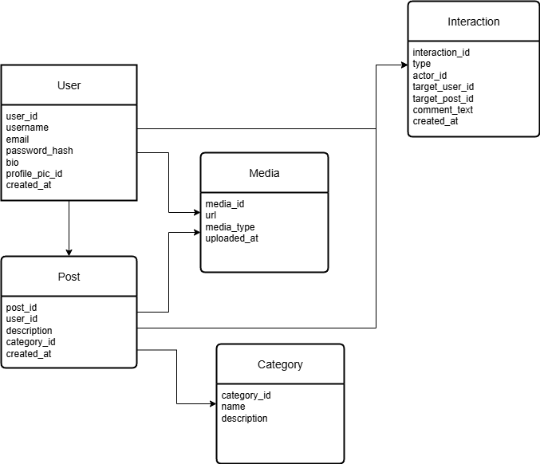

# SocialCrafters - Full-Stack Social Media Platform

A comprehensive social media application designed specifically for crafters, artists, and workshop instructors. This platform enables creative professionals to showcase their work, connect with fellow crafters, book workshops, and build a thriving community around handmade crafts and artistic endeavors.

## 🏗️ Project Structure

```
alx-project-nexus/
├── frontend/                    # React Native/Expo Mobile App
│   ├── app/                    # Screens and navigation
│   │   ├── (tabs)/            # Tab-based navigation
│   │   │   ├── index.tsx      # Home feed
│   │   │   ├── profile.tsx    # User profile
│   │   │   ├── messages.tsx   # Messaging system
│   │   │   ├── workshops.tsx  # Workshop discovery
│   │   │   └── notifications.tsx # Activity notifications
│   │   ├── conversation.tsx   # Chat conversations
│   │   ├── user-profile.tsx   # Dynamic user profiles
│   │   └── workshop-booking.tsx # Workshop booking
│   ├── components/            # Reusable UI components
│   ├── hooks/                 # Custom React hooks
│   ├── graphql/              # GraphQL integration
│   ├── types/                # TypeScript definitions
│   ├── assets/               # Images and icons
│   └── README.md             # Frontend documentation
├── backend/                   # Django API Server
│   ├── apps/                 # Django applications
│   │   ├── users/           # User management
│   │   ├── posts/           # Posts and content
│   │   └── interactions/    # Social interactions
│   ├── social_backend/      # Main Django project
│   ├── ERD.png             # Database schema diagram
│   ├── API_DOCUMENTATION.md # API documentation
│   └── README.md           # Backend documentation
├── README.md               # This file - Project overview
└── .git/                  # Git repository
```

## 🚀 Quick Start

### Frontend (React Native/Expo)
```bash
cd frontend
npm install
npx expo start
```

### Backend (Django)
```bash
cd backend
pip install -r requirements.txt
python manage.py migrate
python manage.py runserver
```

## 📱 Application Features

### **Social Media Core**
- **Instagram-like Interface** with craft-focused content
- **Interactive Posts** with likes, comments, and sharing
- **User Profiles** with portfolio showcases and bio information
- **Real-time Messaging** with conversation management
- **Activity Notifications** for social engagement

### **Craft-Specific Features**
- **Workshop Discovery** and booking system
- **Instructor Profiles** with teaching capabilities
- **Craft Categories** and specialized content
- **Portfolio Management** for showcasing artwork
- **Community Building** around craft specializations

### **Technical Features**
- **Responsive Design** optimized for mobile and tablet
- **Centralized Layout** with consistent UI patterns
- **Dynamic User Navigation** between profiles
- **Real-time Updates** and notifications
- **Offline-Ready** progressive web app capabilities

## 📊 Database Design



The database architecture supports a comprehensive social media platform with:
- **User Management** with authentication and profiles
- **Content Management** for posts and media
- **Social Interactions** including likes, comments, and follows
- **Workshop System** for booking and discovery
- **Messaging System** for real-time communication

## 🎯 Project Overview

This project serves as a comprehensive showcase from the **ALX ProDev Engineering Programs**, demonstrating full-stack development skills, modern software architecture, and collaborative development practices. The platform combines:

- **Frontend Excellence**: React Native mobile app with Instagram-like UX
- **Backend Robustness**: Django API with GraphQL integration
- **Modern Architecture**: Microservices-ready design patterns
- **Industry Standards**: Production-ready code quality and deployment practices

### **Key Achievements**
- ✅ **Full-Stack Integration**: Seamless frontend-backend communication
- ✅ **Mobile-First Design**: Responsive, accessible user interface
- ✅ **Social Media Features**: Complete engagement and interaction system
- ✅ **Workshop Ecosystem**: Booking and discovery for craft instructors
- ✅ **Real-time Capabilities**: Live messaging and notifications
- ✅ **Scalable Architecture**: Database design for production scaling

## About ALX ProDev Frontend Engineering Program

The ProDev Frontend Engineering program is an intensive, hands-on curriculum designed to build world-class frontend developers. The program focuses on:

- **Modern Frontend Technologies**: React, Next.js, React Native, and TypeScript
- **Professional Development Practices**: System Design, Testing, and Deployment
- **Industry-Standard Tools**: GraphQL, API Integration, and PWA development
- **Real-World Projects**: Building production-ready applications with backend collaboration

## About ALX ProDev Backend Engineering Program

The ProDev Backend Engineering program is a comprehensive curriculum focused on building robust, scalable backend systems. This program emphasizes:

- **Core Backend Technologies**: Python, Django, REST APIs, and GraphQL
- **DevOps & Infrastructure**: Docker containerization and CI/CD pipelines
- **Database Management**: Database design, optimization, and scaling strategies
- **Advanced Concepts**: Asynchronous programming, caching strategies, and microservices architecture
- **Industry Best Practices**: Code quality, testing, security, and performance optimization

## 🛠️ Technology Stack

### **Frontend Technologies**
- **React Native** with Expo SDK 53 - Cross-platform mobile development
- **TypeScript** - Type-safe JavaScript for better development experience
- **Expo Router** - File-based navigation system
- **Lucide React Native** - Beautiful, consistent icons
- **Apollo GraphQL** - Efficient data fetching and state management

### **Backend Technologies**
- **Django 4.2+** - Robust Python web framework
- **GraphQL** with Graphene-Django - Flexible API query language
- **SQLite/PostgreSQL** - Relational database management
- **Django REST Framework** - API development utilities
- **JWT Authentication** - Secure token-based authentication

### **Development & Deployment**
- **Git** - Version control and collaboration
- **Expo Application Services (EAS)** - Mobile app deployment
- **Docker** - Containerization for consistent environments
- **CI/CD Pipelines** - Automated testing and deployment

## 🏛️ Architecture Overview

The SocialCrafters platform follows modern software architecture principles:

- **Separation of Concerns**: Frontend and backend in dedicated directories
- **API-First Design**: GraphQL API enabling multiple client applications
- **Component-Based UI**: Reusable React Native components
- **Responsive Design**: Mobile-first with tablet optimization
- **Scalable Database**: Normalized schema with proper indexing

## Major Learnings & Technologies

### Frontend Technologies Covered
- **Mobile Development**: React Native with Expo SDK 53
- **Web Development**: Next.js with server-side rendering
- **Progressive Web Apps (PWA)**: Offline-first applications
- **TypeScript**: Type-safe JavaScript development
- **GraphQL**: Modern API query language and runtime
- **TailwindCSS**: Utility-first CSS framework
- **API Integration**: RESTful and GraphQL API consumption

### Backend Technologies Covered
- **Python**: Core programming language for backend development
- **Django**: High-level Python web framework for rapid development
- **REST APIs**: RESTful web service design and implementation
- **GraphQL**: Flexible query language for APIs with single endpoint
- **Docker**: Containerization for consistent deployment environments
- **CI/CD**: Continuous Integration and Continuous Deployment pipelines

### Key Frontend Development Concepts
- **System Design and Analysis**: Scalable architecture planning
- **State Management**: Redux Toolkit and Context API patterns
- **Performance Optimization**: Code splitting, lazy loading, and caching
- **Responsive Design**: Mobile-first development approach
- **Authentication & Authorization**: JWT and OAuth implementations
- **Real-time Features**: WebSocket integration for live updates

### Key Backend Development Concepts
- **Database Design**: Relational database modeling, normalization, and optimization
- **Asynchronous Programming**: Non-blocking I/O operations and task queues
- **Caching Strategies**: Redis implementation, cache invalidation, and performance tuning
- **API Security**: Authentication, authorization, rate limiting, and data validation
- **Microservices Architecture**: Service decomposition and inter-service communication
- **Performance Monitoring**: Logging, metrics collection, and system optimization

### Challenges Faced & Solutions Implemented

#### Challenge 1: Cross-Platform Compatibility
**Problem**: Ensuring consistent UI/UX across iOS and Android
**Solution**: Implemented Expo Router with platform-specific components and thorough testing on both platforms

#### Challenge 2: Real-time Data Synchronization
**Problem**: Keeping craft posts and user interactions synchronized
**Solution**: Integrated GraphQL subscriptions with Apollo Client for real-time updates

#### Challenge 3: Image Optimization for Craft Portfolios
**Problem**: Large image files affecting app performance
**Solution**: Implemented progressive image loading with Expo Image and server-side optimization

#### Challenge 4: Backend Integration
**Problem**: Coordinating with ProDev Backend learners for API development
**Solution**: Used collaborative tools and shared GraphQL schemas for seamless integration

#### Challenge 5: Database Optimization for High Traffic
**Problem**: Managing database performance under concurrent user loads
**Solution**: Implemented database indexing, connection pooling, and query optimization techniques

#### Challenge 6: Containerization and Deployment
**Problem**: Ensuring consistent deployment across different environments
**Solution**: Dockerized both frontend and backend services with multi-stage builds and environment-specific configurations

## Tech Stack Implementation

### Frontend Architecture
- **React Native** with **Expo SDK 53** for cross-platform mobile development
- **Expo Router** for file-based navigation and routing
- **TypeScript** for type safety and better developer experience
- **Apollo Client** for GraphQL state management and caching
- **React Native Reanimated** for smooth animations and transitions

### Backend Architecture
- **Django 5.0** with **GraphQL** (Graphene) for flexible API queries
- **PostgreSQL/SQLite** for robust data persistence and relationships
- **Docker** containerization for consistent development and deployment
- **Redis** caching for improved response times and session management
- **JWT Authentication** for secure, stateless user sessions
- **CI/CD Pipeline** with automated testing and deployment processes
- **CORS** configuration for seamless frontend-backend communication

## Project Structure

```
project/
├── app.json             # Expo app configuration
├── package.json         # Frontend dependencies and scripts
├── tsconfig.json        # TypeScript configuration
├── app/                 # Expo Router pages (file-based routing)
│   ├── _layout.tsx      # Root layout with navigation
│   ├── +not-found.tsx   # 404 error handling
│   └── (tabs)/          # Tab navigation for main features
│       ├── _layout.tsx  # Tab layout configuration
│       ├── index.tsx    # Crafters feed homepage
│       ├── profile.tsx  # User profile & portfolio
│       └── notifications.tsx # Real-time notifications
├── components/          # Reusable UI components
│   ├── PostCard.tsx     # Craft post display component
│   └── PostSkeleton.tsx # Loading state component
├── hooks/              # Custom React hooks
│   ├── useFrameworkReady.ts # App initialization hook
│   └── useMockData.ts   # Development data hook
├── lib/                # Configuration and utilities
│   └── apollo-client.ts # GraphQL client setup
├── graphql/            # GraphQL operations
│   ├── queries.ts      # Data fetching queries
│   └── mutations.ts    # Data modification operations
├── types/              # TypeScript definitions
│   └── graphql.ts      # Auto-generated GraphQL types
├── assets/             # Static resources
│   └── images/         # App icons and images
│       ├── favicon.png
│       └── icon.png
└── backend/            # Django GraphQL API server
    ├── manage.py       # Django management script
    ├── requirements.txt # Python dependencies
    ├── apps/           # Domain-specific Django applications
    │   ├── __init__.py
    │   ├── users/      # Crafter profiles and authentication
    │   │   ├── __init__.py
    │   │   ├── admin.py    # Admin interface configuration
    │   │   ├── apps.py     # App configuration
    │   │   ├── models.py   # User and Follow models
    │   │   └── schema.py   # GraphQL schema for users
    │   ├── posts/      # Craft posts and media management
    │   │   ├── __init__.py
    │   │   ├── admin.py    # Admin interface configuration
    │   │   ├── apps.py     # App configuration
    │   │   ├── models.py   # Post and CraftCategory models
    │   │   └── schema.py   # GraphQL schema for posts
    │   └── interactions/ # Likes, comments, follows
    │       ├── __init__.py
    │       ├── admin.py    # Admin interface configuration
    │       ├── apps.py     # App configuration
    │       ├── models.py   # Like, Comment, Share models
    │       └── schema.py   # GraphQL schema for interactions
    └── social_backend/ # Main Django configuration
        ├── __init__.py
        ├── schema.py   # Main GraphQL schema
        ├── settings.py # Django settings
        ├── urls.py     # URL configuration
        └── wsgi.py     # WSGI configuration
```

## Setup & Installation

### Prerequisites
- Node.js 18+ and npm
- Python 3.9+ and pip
- Expo CLI (`npm install -g @expo/cli`)

### Frontend Setup
```bash
# Install dependencies
npm install

# Start development server
npm run dev

# Run on specific platform
npx expo run:ios
npx expo run:android
```

### Backend Setup
```bash
# Navigate to backend directory
cd backend

# Install Python dependencies
pip install -r requirements.txt

# Set up environment variables
cp .env.example .env

# Run database migrations
python manage.py migrate

# Start Django server
python manage.py runserver
```

## Features for Crafters

- **Craft Portfolio Showcase**: Upload and display handmade products
- **Real-time Social Feed**: See latest creations from fellow crafters
- **Interactive Engagement**: Like, comment, and share craft posts
- **Crafter Profiles**: Detailed profiles with craft specializations
- **Push Notifications**: Stay updated on community interactions
- **Search & Discovery**: Find crafters by craft type or location

## Development Workflow

- **Frontend**: Expo development server with hot reload
- **Backend**: Django development server with auto-restart
- **Database**: SQLite for development, PostgreSQL for production
- **API Testing**: GraphQL Playground at `/graphql`
- **Mobile Testing**: Expo Go app for quick device testing

## Collaboration & Backend Integration

This project demonstrates successful collaboration between **ProDev Frontend and Backend learners**, showcasing the integration of both engineering disciplines:

### Frontend-Backend Integration Achievements
- **Unified GraphQL Schema**: Seamless data flow between mobile app and Django API
- **Authentication Flow**: JWT token management across platforms
- **Real-time Features**: WebSocket integration for live notifications
- **File Upload**: Image handling for craft portfolio uploads
- **Database Optimization**: Efficient queries and caching strategies
- **Containerized Deployment**: Docker setup for both frontend and backend services

## Best Practices & Personal Takeaways

### Technical Best Practices Learned
1. **Component Architecture**: Building reusable, testable React Native components
2. **State Management**: Efficient data flow with Apollo Client and local state
3. **Error Handling**: Comprehensive error boundaries and user feedback
4. **Performance**: Image optimization and lazy loading for mobile devices
5. **Testing**: Unit tests for components and integration tests for API calls
6. **Database Design**: Normalized schema design with proper indexing strategies
7. **API Security**: Input validation, rate limiting, and secure authentication
8. **Code Quality**: Automated linting, formatting, and code review processes
9. **Documentation**: Comprehensive API documentation and code comments
10. **Monitoring**: Error tracking, performance monitoring, and logging systems

### Personal Development Insights
- **Cross-Functional Collaboration**: Working effectively with both frontend and backend developers
- **Problem-Solving**: Breaking down complex full-stack features into manageable tasks
- **Code Quality**: Writing maintainable, documented, and scalable code across the stack
- **User Experience**: Designing intuitive mobile interfaces backed by efficient APIs
- **Project Management**: Using Agile methodologies for coordinated frontend-backend development
- **DevOps Understanding**: Containerization, deployment pipelines, and infrastructure management
- **Communication Skills**: Effectively communicating technical concepts across teams

## API Documentation

GraphQL API available at `/graphql` with schema including:

### User Management
- `query { users }` - Get crafter profiles
- `mutation { createUser }` - Register new crafter
- `mutation { loginUser }` - Authenticate crafter

### Craft Posts
- `query { posts }` - Fetch craft feed
- `mutation { createPost }` - Share new craft
- `mutation { updatePost }` - Edit craft post

### Social Interactions
- `mutation { likePost }` - Like craft posts
- `mutation { addComment }` - Comment on crafts
- `subscription { postUpdated }` - Real-time post updates

## Deployment & Production

### Frontend Deployment
- **Expo Application Services (EAS)**: Automated app store deployment for iOS and Android
- **Web Build**: Progressive Web App deployment with service workers
- **CDN Integration**: Optimized asset delivery and caching strategies

### Backend Deployment
- **Docker Containerization**: Multi-stage builds for optimized production images
- **CI/CD Pipeline**: Automated testing, building, and deployment processes
- **Database Management**: PostgreSQL with connection pooling and backup strategies
- **Caching Layer**: Redis implementation for session management and data caching
- **Monitoring & Logging**: Comprehensive error tracking and performance analytics
- **Security**: SSL/TLS encryption, environment variable management, and security headers

## Project Deliverables

### ERD Database Design
**Entity Relationship Diagram**: Complete visual representation of the SocialCrafters database schema


The comprehensive database design includes detailed documentation in the [Backend README](backend/README.md).

## 📚 Documentation

### **Detailed Documentation**
- 📱 **[Frontend Documentation](frontend/README.md)** - React Native app setup, architecture, and features
- 🐍 **[Backend Documentation](backend/README.md)** - Django API, database design, and deployment
- 📊 **[API Documentation](backend/API_DOCUMENTATION.md)** - GraphQL schema and endpoint details

### **Key Resources**
- **ERD Schema**: Visual database design located at `backend/ERD.png`
- **Component Library**: Reusable UI components in `frontend/components/`
- **GraphQL Integration**: Type-safe API layer with Apollo Client
- **Workshop System**: Complete booking and discovery functionality

### Project Presentation
**Slide Deck**: Comprehensive presentation covering full-stack architecture, implementation, and collaborative development

**Link**: [Project Presentation - SocialCrafters Full-Stack Platform](https://docs.google.com/presentation/d/your-slides-link-here)

**Presentation Outline**:
1. **Project Overview & Objectives**
2. **Full-Stack Architecture & Technology Decisions**
3. **Database Design & ERD Explanation** - [View ERD](backend/ERD.png)
4. **Frontend Implementation** - [React Native Documentation](frontend/README.md)
5. **Backend Implementation** - [Django API Documentation](backend/README.md)
6. **GraphQL Integration & API Design**
7. **Collaborative Development Process**
8. **Challenges & Solutions**
9. **Industry Best Practices Applied**
10. **Deployment & Production Setup**
11. **Demo & Live Features**

### Demo Video
**Project Demonstration**: 5-minute video showcasing the SocialCrafters platform in action

**Link**: [Demo Video - SocialCrafters Full-Stack Platform](https://your-video-link-here)

**Demo Content**:
- **User Registration & Authentication**: New crafter signup and login flow
- **Profile Creation**: Setting up crafter profile with workshop capabilities
- **Social Feed**: Instagram-like browsing experience with craft content
- **Workshop Discovery**: Finding and booking creative workshops
- **Interactive Features**: Liking, commenting, and user profile navigation
- **Messaging System**: Real-time conversations between crafters
- **Portfolio Showcase**: Artist gallery and work presentation
- **Responsive Design**: Mobile and tablet optimization demonstration

**Industry Best Practices Demonstrated**:
- **Mobile-First Design**: Responsive UI optimized for mobile devices
- **API Security**: JWT authentication and input validation
- **Performance Optimization**: Image caching and lazy loading
- **Error Handling**: Graceful error boundaries and user feedback
- **Code Quality**: TypeScript integration and clean architecture

### Hosted Project
**Live Application**: Deployed Crafters Social Feed accessible via web and mobile

**Frontend (Mobile App)**: [Expo Published App](https://expo.dev/@your-username/crafters-social-feed)
**Backend API**: [Django GraphQL API](https://your-backend-domain.com/graphql)
**Web Dashboard**: [Admin Interface](https://your-backend-domain.com/admin)

**Hosting Infrastructure**:
- **Frontend**: Expo Application Services (EAS) for mobile deployment
- **Backend**: Docker containers on cloud platform (AWS/Heroku/DigitalOcean)
- **Database**: PostgreSQL with automated backups
- **Media Storage**: Cloud CDN for optimized image delivery
- **Monitoring**: Error tracking and performance analytics

---

## 🤝 ALX ProDev Collaboration

**Frontend Team**: React Native/Expo development with modern mobile UX patterns
**Backend Team**: Django API development with GraphQL integration
**Collaboration Tools**: Git workflows, shared documentation, and unified testing strategies

**Built with ❤️ as part of the ALX ProDev Frontend & Backend Engineering Programs**

*This project showcases the culmination of intensive learning in both frontend and backend development, demonstrating full-stack application building skills, collaborative development practices, and modern software engineering principles.*

## 📄 License

This project is created for educational purposes as part of the ALX ProDev Engineering Programs.

## 🙏 Acknowledgments

- **ALX ProDev Engineering Programs** for providing comprehensive full-stack development education
- **Crafting Community** for inspiring this specialized social platform
- **Open Source Libraries** that made this project possible
- **Collaborative Learning** environment that enhanced the development process